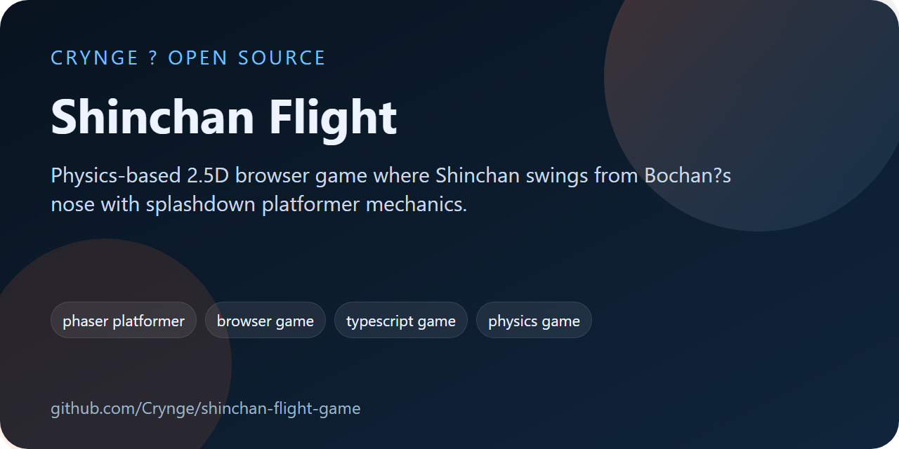
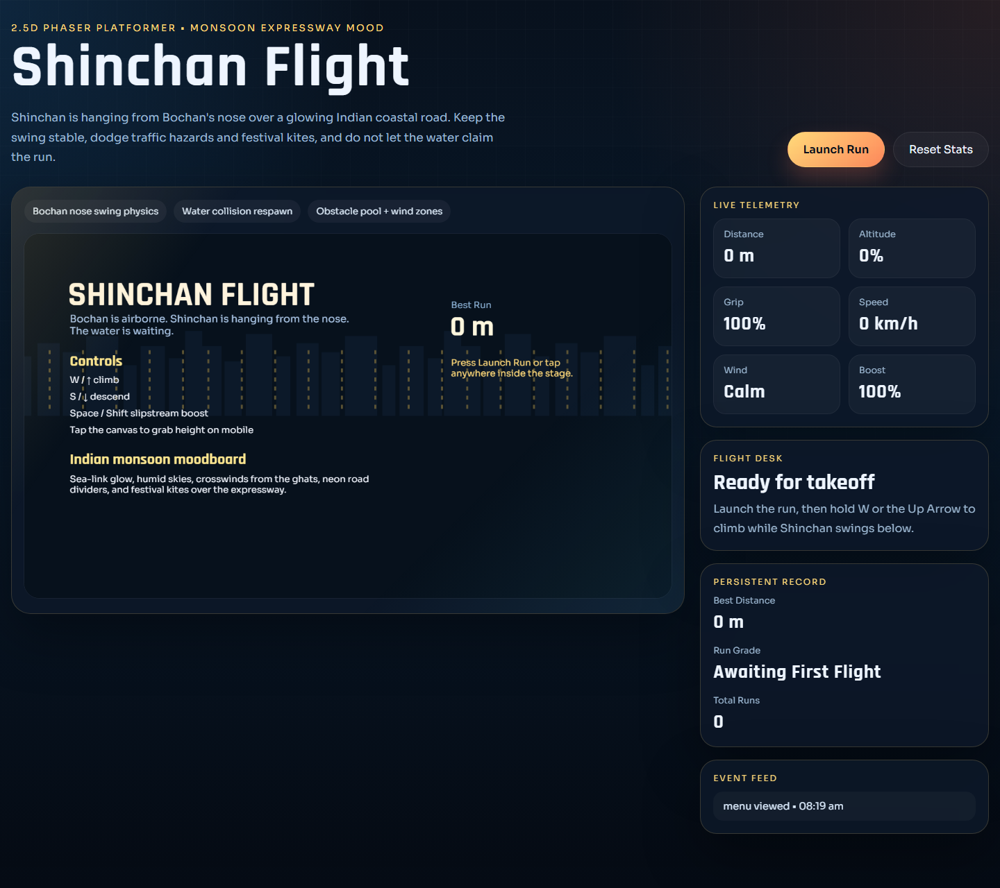
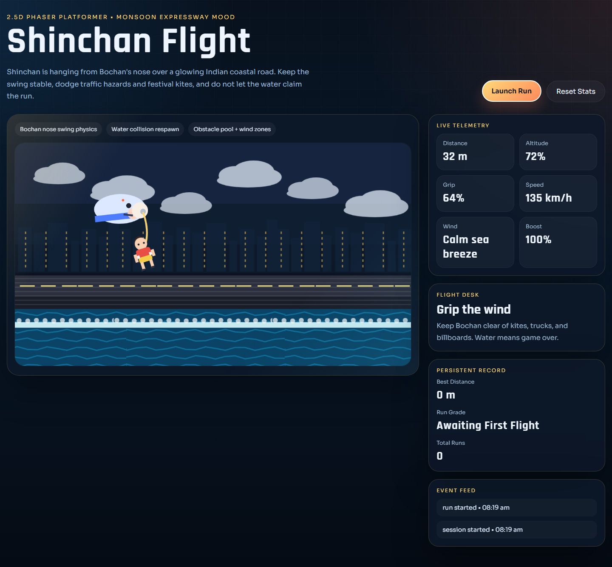
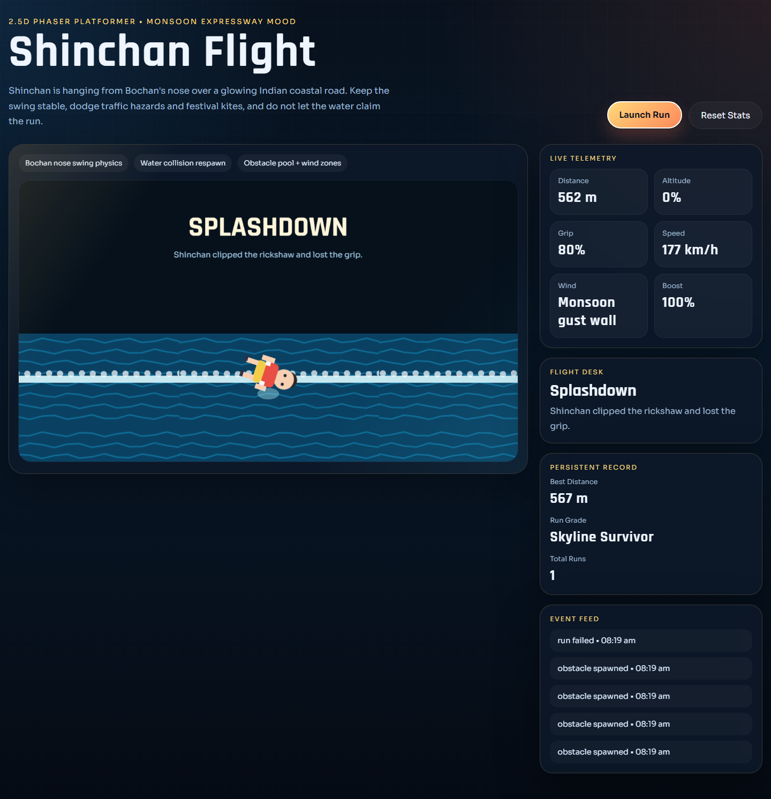

# Shinchan Flight

<!-- portfolio-seo:start -->
  



> Physics-based 2.5D browser game where Shinchan swings from Bochan?s nose with splashdown platformer mechanics.

**GitHub Search Keywords:** phaser platformer, browser game, typescript game, physics game, shinchan style platformer, web game prototype

<!-- portfolio-seo:end -->

<!-- portfolio-links:start -->
<div align="center">

[Documentation](docs) &middot; [Architecture](docs/architecture.md) &middot; [Audit](docs/final-audit.md) &middot; [Screenshots](docs/screenshots) &middot; [Contributing](CONTRIBUTING.md) &middot; [Security](SECURITY.md) &middot; [Authors](AUTHORS.md) &middot; [Workflows](.github/workflows)

</div>
<!-- portfolio-links:end -->


A polished 2.5D browser game where Shinchan hangs from Bochan's nose while Bochan flies above a glowing Indian coastal expressway. If Shinchan loses the grip, he drops straight into the monsoon water below in a fast splashdown sequence inspired by classic platformer fail states.

## Why this stack

This repo deliberately keeps the runtime focused instead of mixing too many engines:

- TypeScript + Phaser 3 for the core game loop
- Matter.js through Phaser for swing physics
- CSS for the cinematic shell and HUD
- JSON for tunable wind zones and obstacle patterns
- Python Playwright for browser smoke testing
- GitHub Actions for automated verification

That gives you a fast browser build without the dependency sprawl that usually hurts performance.

## Features

- Physics-driven nose-swing mechanic with Bochan as the moving anchor
- Monsoon-coast visual direction with Indian highway mood, water, skyline, and neon lane dividers
- Obstacle pool with rickshaws, trucks, LED billboards, and kites
- Wind-zone system driven by [`assets/maps/flight-pattern.json`](./assets/maps/flight-pattern.json)
- Splash scene + respawn/game-over loop
- Persistent best distance, run grade, and run count via `localStorage`
- Lightweight analytics event feed for tuning replay behavior
- Responsive presentation shell built for desktop and mobile browsers

## Screenshots

### Menu screen



### Mid-run gameplay



### Splashdown and fail-state flow



## Architecture

```text
src/
|-- entities/   Bochan, Shinchan, obstacle pool, clouds, water bands
|-- scenes/     Boot, Menu, Game, WaterSplash, GameOver
|-- systems/    Input, audio, HUD, analytics, state persistence
|-- utils/      Math helpers and grading
`-- main.ts     UI chrome + Phaser bootstrapping
```

More detail is in [docs/architecture.md](./docs/architecture.md).

## Quick start

```bash
npm install
npm run dev
```

Open the local Vite URL, press `Launch Run`, then:

- `W` / `↑` to climb
- `S` / `↓` to descend
- `Space` / `Shift` to boost
- tap/click in the game stage for mobile-style lift input

## Verification

```bash
npm run audit
python -m playwright install chromium
python C:/Users/samee/.codex/skills/webapp-testing/scripts/with_server.py --server "npm run preview" --port 4173 -- python tests/browser_smoke.py
python C:/Users/samee/.codex/skills/webapp-testing/scripts/with_server.py --server "npm run preview" --port 4173 -- python tests/capture_gallery.py
```

The latest audit summary lives in [docs/final-audit.md](./docs/final-audit.md).

## Author

This repo is authored and maintained by [Sameer Alam](./AUTHORS.md). Commits are configured to use the `Crynge` GitHub identity, not `codex`.

## Product notes

- "8D" is interpreted here as a rich 2.5D presentation, because there is no real 8D game-development standard.
- The character art is stylized runtime-generated fan-project art, not ripped assets.
- This repo is optimized for browser deployment first. If you want native packaging later, Phaser can be wrapped with Electron, Tauri, or mobile web-view shells.

## License

MIT
